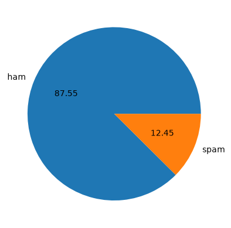
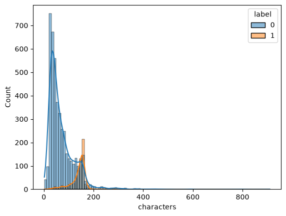
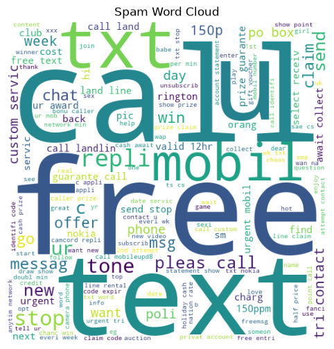
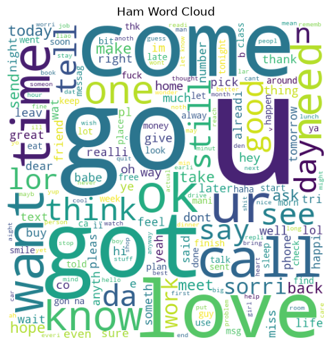
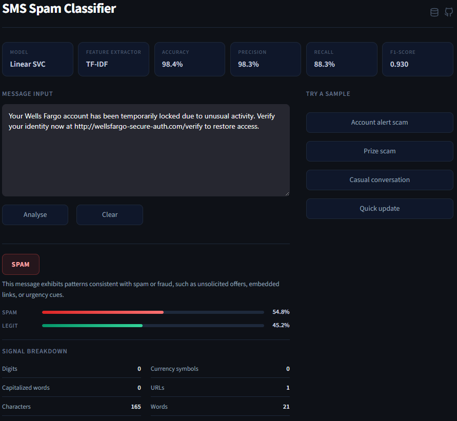

# SMS Spam Classifier

In this project, I built an SMS spam classifier using machine learning. I trained and evaluated multiple models such as  **Naive Bayes**, **Support Vector Machines**, and **Logistic Regression** on the [UCI SMS Spam Collection dataset](https://www.kaggle.com/datasets/uciml/sms-spam-collection-dataset), comparing their performance using standard evaluation metrics to identify the most effective model.

## Dataset and Preprocessing

The project uses the UCI SMS Spam Collection dataset, containing **5,572** raw messages. I removed duplicates, decoded HTML entities, and stripped surrounding whitespace before encoding `ham` as 0 and `spam` as 1. Before vectorization, messages were lowercased, tokenized, filtered to alphanumeric tokens, stripped of stopwords, and Porter-stemmed.

## Exploratory Data Analysis

### Class Distribution

The dataset is heavily imbalanced, with a vast majority of messages being ham and only a small fraction being spam. This imbalance means I have to be careful with metrics like accuracy, precision, recall, and F1-score will be much more informative for evaluating model performance on the minority class.

### Message Lengths

There is a distinct difference in the character length distribution between ham and spam messages. Ham messages tend to be shorter, mostly clustering around 50 characters, while spam messages are generally much longer, clustering around 150 characters. This length difference is a strong structural cue that can help in classification.

### Word Clouds

The word clouds reveal distinct vocabularies. Spam messages heavily rely on words designed to create urgency or offer rewards (*free*, *call*, *text*, *txt*, *claim*, *prize*). Ham messages use more conversational and everyday vocabulary (*go*, *get*, *come*, *know*).

## Models and Results

### Text Vectorization Benchmark

| Vectorizer     | Vocab Size | Accuracy | Precision |  Recall  | F1-Score |
| :------------- | :--------: | :------: | :-------: | :------: | :------: |
| Bag of Words   |    5952    | 0.978682 | 0.934426  | 0.890625 | 0.912000 |
| TF-IDF         |    5952    | 0.960271 | 0.988764  | 0.687500 | 0.811060 |

### Multi-Model Classifier Benchmark

Using TF-IDF vectorization, I compared several classifiers:

| Model                   | Accuracy | Precision |  Recall  | F1-Score |
| :---------------------- | :------: | :-------: | :------: | :------: |
| Multinomial Naive Bayes | 0.970930 | 0.980392  | 0.781250 | 0.869565 |
| Bernoulli Naive Bayes   | 0.978682 | 0.990741  | 0.835938 | 0.906780 |
| Logistic Regression     | 0.962209 | 1.000000  | 0.695312 | 0.820276 |
| Linear SVC              | 0.983527 | 0.982609  | 0.882812 | 0.930041 |
| SVC (RBF Kernel)        | 0.981589 | 1.000000  | 0.851562 | 0.919831 |

**Linear SVC** achieved the best overall performance, with a high F1-score of 0.930041, indicating a good balance between precision and recall.
## App Preview

